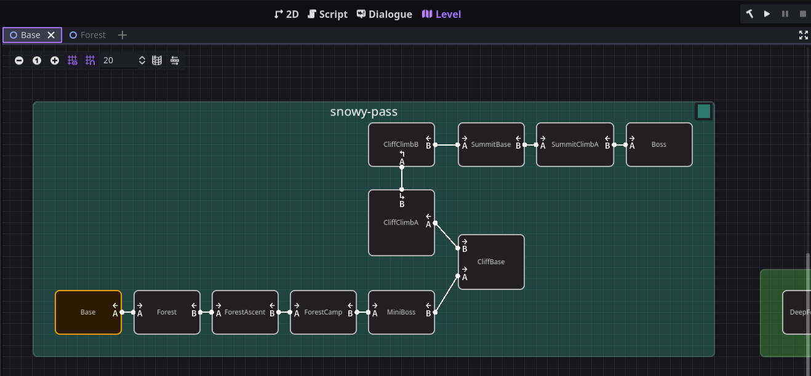

# Godot Level Graph

Godot addon for level organization and room transitions using Area2D nodes.

This is a mirror of the addon in my game project, so I won't be actively maintaining it. Feel free to fork and modify it to your needs.



## Setup

1. Copy the `addons/level_graph` folder to your project's `addons` folder.
2. Enable the plugin in the project settings.
3. In your project settings, set `Level Graph > General > Root Directory` to a folder where your level scenes will be stored.
4. Add `Exit` nodes into your scenes to define the room transitions.
5. Go to the `Level` editor tab and select `Reload levels`.
6. Connect your levels using the `Connect` button.
7. Setup your code. Use the `LevelGraph` singleton to get information about the levels and exits.

   ```gdscript
   # player.gd - Must be a body or area

   func _ready():
     LevelGraph.set_player(self)


   # stage_manager.gd - Whatever script you want to manage level changes

   func _ready() -> void:
     LevelGraph.level_changed.connect(_on_level_change)

   func _on_level_change(from_level: String, from_exit: int) -> void:
     var exit: Exit = LevelGraph.get_exit_node_in_level(from_exit)
     player.leave_level(exit.orientation) # For animating exit

     var dest: Dictionary = LevelGraph.get_destination(from_level, from_exit)
     get_tree().change_scene_to_file(dest["level"]) # Or whatever method you use to transition scenes

     var entry: Exit = LevelGraph.get_exit_node_in_level(dest["exit"])

     player.global_position = LevelGraph.get_exit_node_spawn_position(entry)
     player.enter_level(entry.orientation) # For animating entry
   ```
